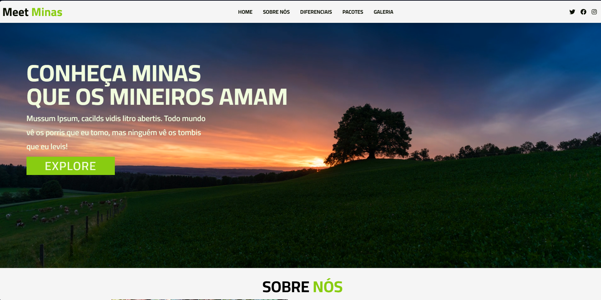

<h1 align="center" style="font-weight: bold;">Meet Minas 🌄</h1>

<p align="center">
 <a href="#tecnologias">Tecnologias</a> • 
 <a href="#preview">Preview</a> • 
 <a href="#como-rodar">Como Rodar</a> 
</p>

<p align="center">
    <b>Site de uma agência fictícia de viagens e turismo em Minas Gerais, desenvolvido como projeto de estudo com HTML, CSS e JavaScript.</b>
</p>

<p align="center">
    <b>LINK DO SITE NO AR: https://dieegoo13.github.io/meet-minas/</b>
</p>

<h2 id="tecnologias">💻 Tecnologias</h2>

<div>
  
  <span>HTML</span>
</div>
<div>
  
  <span>CSS</span>
</div>
<div>
  
  <span>JavaScript</span>
</div>

<h2 id="como-rodar">Como Rodar</h2>

1️⃣ Clone o repositório:
```bash
git clone https://github.com/Dieegoo13/meet-minas.git
```

<h2 id="preview">📸 Preview do Projeto</h2>

  
